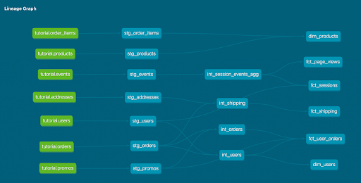

What is our user repeat rate? 79.84%
```
WITH repeat_orders AS (

  SELECT user_id as repeat_order_user_id
  FROM dbt_katie_s.stg_orders AS orders
  GROUP BY user_id
  HAVING COUNT(DISTINCT order_id) > 1
)

SELECT ROUND((COUNT(DISTINCT repeat_orders.repeat_order_user_id))::numeric / 
        (COUNT(DISTINCT orders.user_id)::numeric)*100,2) as repeat_rate
FROM dbt_katie_s.stg_orders AS orders
LEFT JOIN repeat_orders on orders.user_id = repeat_orders.repeat_order_user_id;
```

What are good indicators of a user who will likely purchase again? What about indicators of users who are likely NOT to purchase again? If you had more data, what features would you want to look into to answer this question?
 * Someone ,ay not order again if they had a bad experience (e.g., shipment was late or product did not meet expectations). 
 * May order again if they had a positive experience with Greenery (e.g., saved money with promo code, free shipping, etc.) 
 * There could be trends related to geography, specific products, etc. It would be great if we had a table of customer feedback linked to orders and/or products in the future.
 * If we had more data, we could look at longer term trends. For instance, maybe certain customers order at predictable times like each year on Valentine’s Day.


Explain the marts models you added. Why did you organize the models in the way you did?
 * Intermediate models were created to do initial transformations for the recommended dim and fact models. I tried to create intermediate models that could be used to feed multiple dim/fact tables.
 * Also added a fact_shipping model. This model combines order and shipping information. You can see if an order arrived early, on time, or late along with the shipping method and destination. I figured this could be useful for logistics and to test some of my hypotheses about what drives repeat orders.


Paste in an image of your DAG from the docs.


What assumptions are you making about each model? (i.e. why are you adding each test?) 
 * After looking at the data, I added `unique` tests for the primary keys. I also added `not_null` tests for fields that looked mandatory.
 * For fields that I assumed should be > 0, I added the `positive_values` test from Week 1. (There were some fields I didn’t test for positive values, because I could think of cases where a number could be zero and it could be valid, like if someone got free shipping.)
 * For select fields with a limited number of values existing in the table, I added the `acceptable_values` test. That way, if a new value were to show up in the future, I’d be alerted.

Did you find any “bad” data as you added and ran tests on your models? How did you go about either cleaning the data in the dbt model or adjusting your assumptions/tests?
I tested for `zipcode` length being 5 and found some that were 4 digits long, due to dropped leading zeroes. So, I updated the test to make sure zip code length is either 4 or 5. If it is 4, I added a step in the intermediate model to add a leading zero for 4 digit zip codes.

Your stakeholders at Greenery want to understand the state of the data each day. Explain how you would ensure these tests are passing regularly and how you would alert stakeholders about bad data getting through.
I would set up the dbt job to refresh at least once a day. I can monitor the jobs to see if there are any  errors. Ideally, I could even integrate with Slack so that an alert is automatically generated if a test fails.
