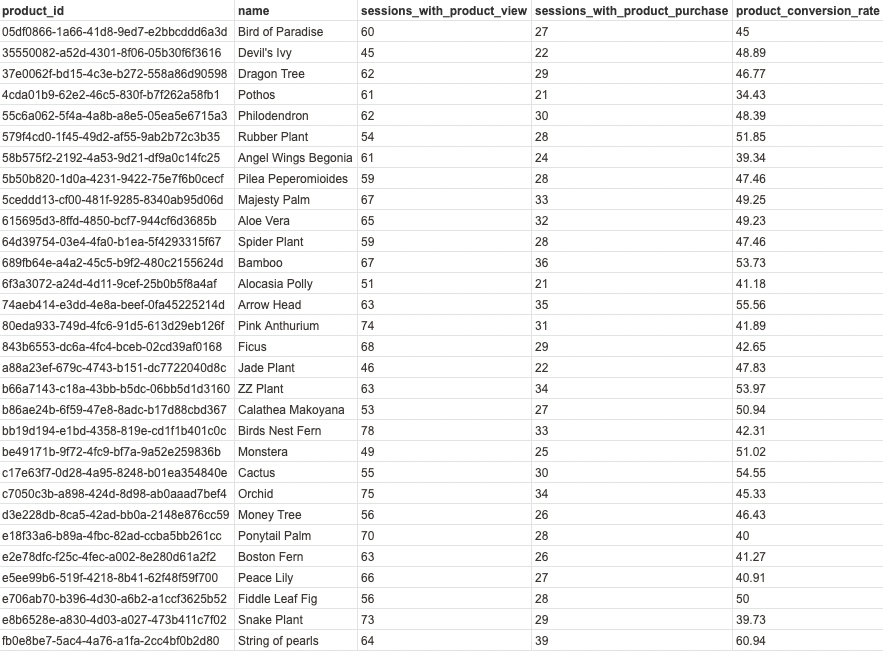
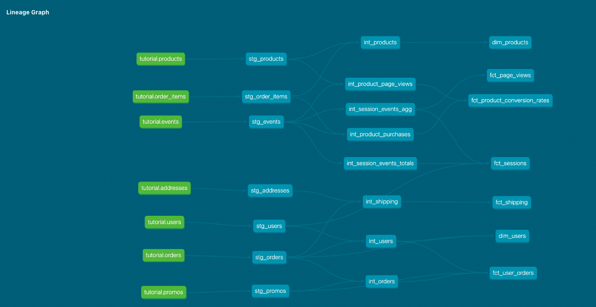

PART 1

What is our overall conversion rate? 62.46%

```
WITH sessions_with_purchase AS (
  SELECT DISTINCT session_id
  FROM dbt_katie_s.fct_sessions
  WHERE checkout = 1
  )

SELECT COUNT(DISTINCT fct_sessions.session_id) as unique_sessions
      , COUNT(DISTINCT sessions_with_purchase.session_id) as unique_sessions_with_purchase
      , ROUND( (COUNT(DISTINCT sessions_with_purchase.session_id)::numeric / COUNT(DISTINCT fct_sessions.session_id)::numeric * 100), 2)  AS overall_conversion_rate
FROM dbt_katie_s.fct_sessions
LEFT JOIN sessions_with_purchase ON fct_sessions.session_id = sessions_with_purchase.session_id
;
```
What is our conversion rate by product?
 

```
WITH product_views AS (
  SELECT events.product_id
        , products.name
        , COUNT(DISTINCT events.session_id) as sessions_with_product_view
  FROM dbt_katie_s.stg_events AS events
  LEFT JOIN dbt_katie_s.stg_products AS products ON events.product_id = products.product_id
  WHERE events.event_type = 'page_view'
  GROUP BY 1, 2
),

product_purchases AS (
  SELECT order_items.product_id
        , COUNT(DISTINCT events.session_id) as sessions_with_product_purchase
  FROM dbt_katie_s.stg_events AS events
  LEFT JOIN dbt_katie_s.stg_order_items AS order_items ON events.order_id = order_items.order_id
  WHERE events.event_type = 'checkout'
  GROUP BY order_items.product_id
  )
  
SELECT product_views.product_id
      , product_views.name
      , product_views.sessions_with_product_view
      , product_purchases.sessions_with_product_purchase
      , ROUND(product_purchases.sessions_with_product_purchase::numeric / product_views.sessions_with_product_view::numeric * 100, 2) as product_conversion_rate
FROM product_views
JOIN product_purchases ON product_views.product_id = product_purchases.product_id
;
```

Create new models to answer these questions. 
* I created new model in Product called fct_product_conversion_rates

Why might certain products be converting at higher/lower rates than others? Note: we don't actually have data to properly dig into this, but we can make some hypotheses.
* Price - if price is high, perhaps customers will buy a cheaper alternative product
* Whether product is currently in stock
* Product reviews

PART 2

Create a macro to simplify part of a model(s). 
* I had a test for zip code length and I converted that to a macro so I can use it across multiple models (instead of previously where I hard coded variables)
* I also added `get_events_type` macro to run a loop and count event types and used that in `int_sessions_events_totals` model

PART 3

Add a post hook to your project to apply grants to the role “reporting”. Create reporting role first by running CREATE ROLE reporting in your database instance.
* Was able to get on-run-end hook to work, but had trouble with post-hook and was getting an error

PART 4

After learning about dbt packages, we want to try one out and apply some macros or tests. Install a package (i.e. dbt-utils, dbt-expectations) and apply one or more of the macros to your project
* Used `month_name` and `day_name` from dbt-date package in my fct_shipping model. My rationale was that we could use this to identify trends (e.g., if people create an order in Dec, is it more likely to be shipped late vs. other months)?

PART 5
Show (using dbt docs and the model DAGs) how you have simplified or improved a DAG using macros and/or dbt packages.
 
